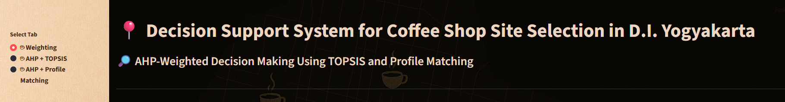
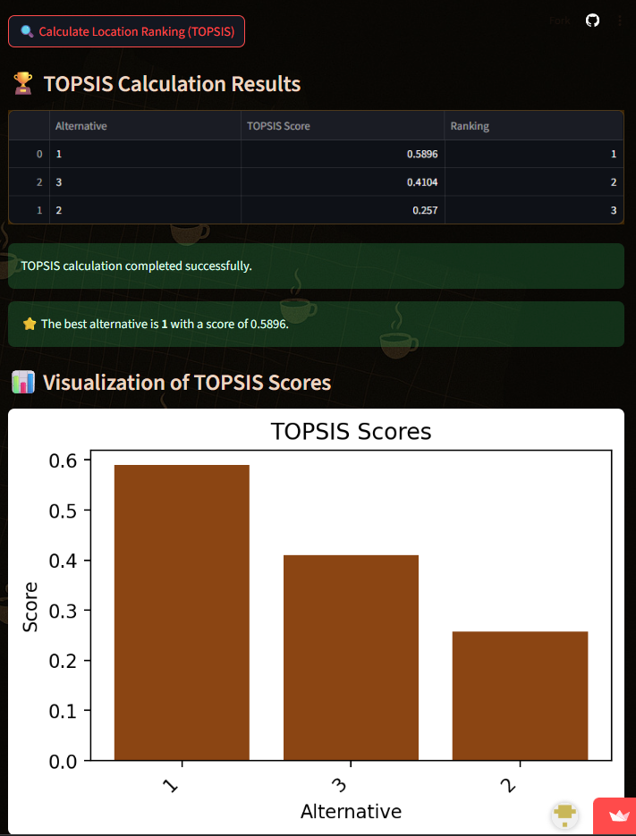
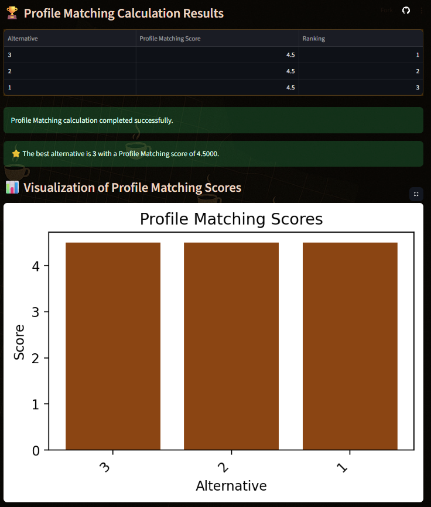

# ☕ Decision Support System for Coffee Shop Site Selection Based in DIY on AHP Integrated with TOPSIS and Profile Matching


## 1. Deskripsi Umum

Website ini merupakan aplikasi **Sistem Pendukung Keputusan (SPK)** berbasis web yang dirancang untuk membantu proses pengambilan keputusan dalam **pemilihan lokasi kedai kopi (coffee shop)** secara objektif dan terstruktur. Sistem ini memanfaatkan kombinasi metode pengambilan keputusan sebagai berikut:

- **AHP** (Analytic Hierarchy Process)
- **Integrasi AHP dan TOPSIS** (Technique for Order Preference by Similarity to Ideal Solution)
- **Integrasi AHP dan Profile Matching**

Sistem ini dirancang secara **fleksibel dan dinamis**, memungkinkan pengguna untuk menyesuaikan kriteria, bobot, serta alternatif sesuai konteks dan kebutuhan masing-masing. Oleh karena itu, selain untuk pemilihan lokasi kedai kopi, aplikasi ini juga dapat digunakan untuk berbagai kasus pengambilan keputusan lainnya, seperti **seleksi kandidat**, **evaluasi proyek**, **pemilihan produk**, dan sebagainya.

Dengan **antarmuka yang ramah pengguna**, sistem ini mendukung proses evaluasi multi-kriteria yang **sistematis dan transparan**, sehingga menghasilkan keputusan yang lebih **tepat dan dapat dipertanggungjawabkan**.

---

## 2. Cara Menjalankan Sistem

Anda dapat menjalankan sistem ini melalui dua cara, yaitu secara **lokal di komputer** atau langsung melalui **tautan web online** yang telah disediakan.

### 🔧 Opsi 1: Menjalankan Secara Lokal

1. Clone repositori dari GitHub:
   ```bash
   git clone https://github.com/ismiinaimah/DSS-for-Coffeeshop-Site-Selection.git
   ```

2. Masuk ke direktori hasil clone dan install semua dependency yang dibutuhkan:
   ```bash
   pip install -r requirements.txt
   ```

3. Jalankan aplikasi menggunakan Streamlit:
   ```bash
   streamlit run program_dss.py
   ```

4. Aplikasi akan terbuka secara otomatis di browser Anda melalui alamat: [http://localhost:8501](http://localhost:8501)

---

### ☁️ Opsi 2: Menjalankan Secara Online melalui Streamlit Cloud

Tanpa perlu instalasi apapun, Anda dapat langsung mengakses aplikasi melalui tautan berikut:

🔗 [https://dss-for-coffeeshop-site-selection.streamlit.app/](https://dss-for-coffeeshop-site-selection.streamlit.app/)

---



---

## 3. Langkah-Langkah Penggunaan Sistem

### 🔹 Langkah 1: Konfigurasi Awal – Input Parameter

1. Masukkan **jumlah alternatif** (lokasi kedai kopi) dan **jumlah kriteria** yang digunakan.
2. Input **nama-nama alternatif** dan **kriteria**.
3. Lakukan **pairwise comparison** antar kriteria untuk menentukan tingkat kepentingan.
4. Sistem akan otomatis menghitung dan menampilkan **tabel bobot kriteria (criteria weights)**.
5. Nilai **Consistency Ratio (CR)** akan muncul di bagian bawah.  
   > Nilai ideal: ≤ 0.1 (Jika lebih, hasil perbandingan bisa dianggap tidak konsisten).

---

### 🔸 Langkah 2: Penggunaan Metode AHP + TOPSIS

1. Setelah parameter dan bobot dimasukkan, pilih metode **AHP + TOPSIS** melalui *radio button* di sisi kiri atas.
2. Tentukan **tipe kriteria**:  
   - **Benefit** (semakin tinggi semakin baik)  
   - **Cost** (semakin rendah semakin baik)
3. Masukkan **nilai alternatif** untuk setiap kriteria pada tabel *Input Decision Matrix*.
4. Klik tombol **"Calculate Location Ranking (TOPSIS)"**.
5. Sistem akan menampilkan:
   - Hasil ranking lokasi
   - Skor TOPSIS
   - Grafik visualisasi hasil



---

### 🔸 Langkah 3: Penggunaan Metode AHP + Profile Matching

1. Pilih metode **AHP + Profile Matching** dari *radio button* di sisi kiri atas.
2. Tentukan **nilai ideal (Profile Ideal Value)** untuk masing-masing kriteria:
   - Skala (1–5)
   - Rentang numerik
3. Tetapkan kriteria sebagai:
   - **Core Factor (CF)**: kriteria utama
   - **Secondary Factor (SF)**: kriteria pendukung
4. Masukkan nilai performa alternatif pada tabel *Input Decision Matrix*.
5. Klik tombol **"Calculate Location Ranking (Profile Matching)"**.
6. Sistem akan menampilkan:
   - Skor CF dan SF
   - Total skor akhir
   - Peringkat masing-masing lokasi
   - Grafik visualisasi hasil



---

## 📹 Video Tutorial & 📌 Poster

- 🎥 **Video Tutorial**:  
  [Tonton di sini](https://drive.google.com/file/d/1hgLURfnpoL154RlrTQCuPnoqMTtusMEl/view?usp=drive_link)

- 📄 **Poster Sistem**:  
  [Lihat poster](https://drive.google.com/file/d/1W53pnc7cu4sHBzE9o0WKaHumqjRJTXC7/view?usp=sharing)

---

## 📬 Kontak

Untuk pertanyaan atau saran, silakan hubungi melalui halaman GitHub atau email yang tersedia dalam repositori.

---

**© 2025 DSS Coffeeshop SPK – Dibuat dengan Streamlit**
